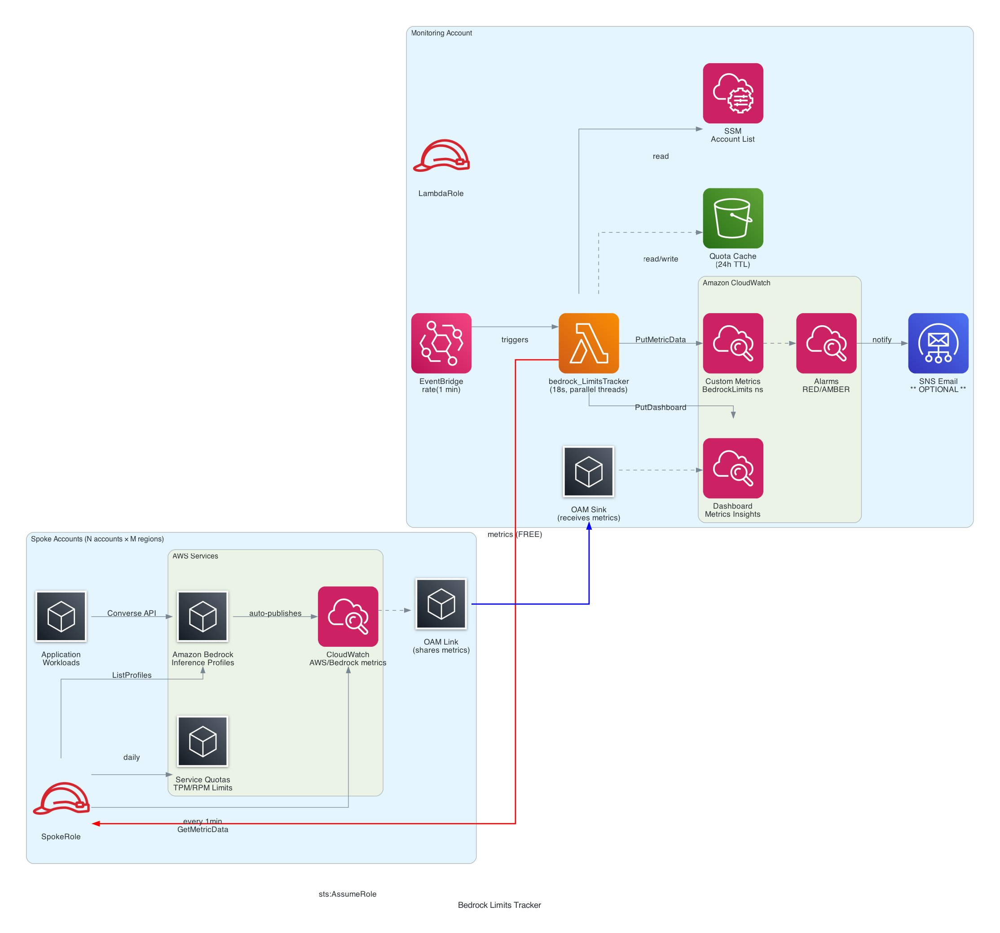
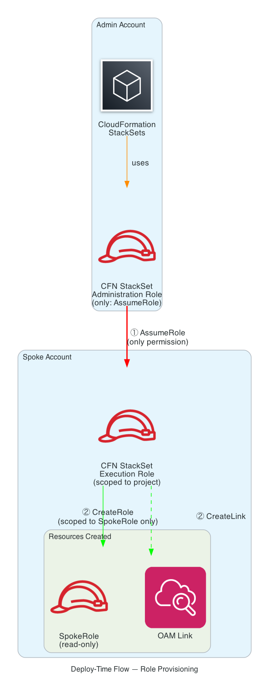
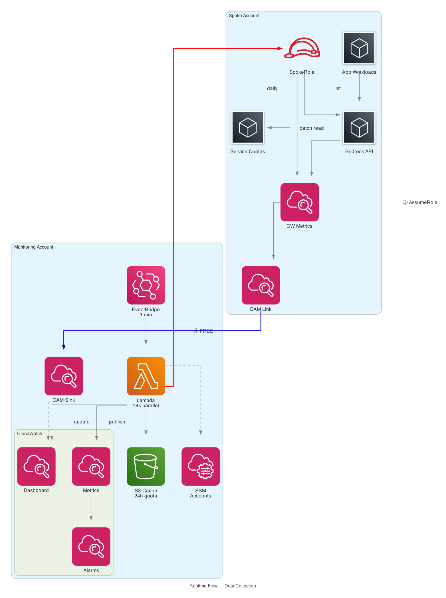

# Bedrock Limits Tracker

## Part 1: Problem & Solution

### The Problem

Amazon Bedrock applies per-model **Tokens Per Minute (TPM)** and **Requests Per Minute (RPM)** quotas at the account+region level. When you run workloads across multiple accounts and regions, there's no native way to:

- See which models are approaching throttling limits across all accounts
- Compare actual usage against account-specific quotas (which may differ from defaults after increases)
- Get alerted before throttling happens

### What This Solution Does

1. **Reads per-model TPM/RPM quotas** from the Service Quotas API in each spoke account (account-specific, not documentation defaults)
2. **Reads actual usage** from CloudWatch `AWS/Bedrock` metrics (Invocations, InputTokenCount, OutputTokenCount)
3. **Computes utilization %** — `usage / effective_quota × 100` — applying 2x multiplier for cross-region inference profiles
4. **Publishes to a centralized CloudWatch dashboard** with RAG (Red/Amber/Green) status per model
5. **Provides real-time Metrics Insights charts** that update every 60s natively (no Lambda in the loop)

### RAG Status

| Status | Condition | Meaning |
|--------|-----------|---------|
| 🔴 RED | Utilization > 90% | Critical — throttling imminent |
| 🟠 AMBER | Utilization > 70% | Warning — approaching limits |
| 🟢 GREEN | Utilization ≤ 70% | Healthy |
| 🔵 NOT_USED | 0% utilization | No recent invocations |

**Cross-region inference profiles** (SYSTEM_DEFINED) get **2x** the effective quota because they route across multiple regions.

### Architecture

> 📐 Architecture diagrams generated with `python3 generate_diagram.py` and `python3 generate_flow_diagrams.py`



```
Source Accounts (per region)              Monitoring Account
┌────────────────────────────┐           ┌──────────────────────────────────────┐
│ IAM Role (assumable)       │           │ OAM Sink (receives native CW metrics)│
│   - service-quotas:List*   │           │                                      │
│   - bedrock:List*          │           │ EventBridge (rate: N min)            │
│   - cloudwatch:GetMetric*  │           │   → bedrock_LimitsTracker Lambda     │
│                            │◄─assumes──│     For each account × region:       │
│ OAM Link ──metrics──────► │───────────│       1. Assume spoke role            │
│   (shares AWS/Bedrock      │           │       2. Read quotas (cached in S3)   │
│    native metrics)         │           │       3. List inference profiles      │
│                            │           │       4. Get CW usage (per model)     │
└────────────────────────────┘           │       5. Compute utilization %        │
                                         │       6. Apply 2x for cross-region    │
                                         │       7. Publish quota limit metrics   │
                                         │                                      │
                                         │ CloudWatch Dashboard                 │
                                         │   📊 Metrics Insights (live, 60s)    │
                                         │   📋 Per-account RAG table           │
                                         │   🔢 Threshold number widgets        │
                                         │                                      │
                                         │ Alarms → SNS → Email                 │
                                         └──────────────────────────────────────┘
```

---

## Part 2: Deployment

### Where Can This Be Deployed?

This solution does **NOT** require the payer/management account:

- Uses **SELF_MANAGED** StackSets (not SERVICE_MANAGED) — no Organizations API needed
- OAM Sink just needs a policy listing account IDs — no org dependency
- Lambda assumes roles via explicit account IDs from SSM — no org trust needed

| Scenario | Works? | Notes |
|----------|--------|-------|
| Monitoring on payer account | ✅ | Common choice |
| Monitoring on a dedicated observability account | ✅ | Best practice for large orgs |
| Monitoring on any linked account | ✅ | Just needs spoke roles to trust it |
| No AWS Organizations at all | ✅ | Explicit account IDs in sink policy + SSM |

### Prerequisites

- An AWS account designated as the monitoring hub
- One or more spoke accounts running Bedrock workloads
- AWS CLI configured with profiles for each account
- Bedrock models enabled in the spoke accounts

### Specifying Accounts to Monitor

Accounts are configured in **two places** that must stay in sync:

| Where | What it controls | How to set |
|-------|-----------------|------------|
| `SourceAccountIds` parameter | OAM Sink policy (who can link) + initial SSM value | At deploy time |
| SSM Parameter `/BedrockLimitsTracker/SourceAccounts` | Which accounts the Lambda scans at runtime | Update anytime |

**Option A: Explicit account list** (recommended for controlled environments)

```bash
--parameter-overrides "SourceAccountIds=<SOURCE_ACCOUNT_A>,<SOURCE_ACCOUNT_B>,<SOURCE_ACCOUNT_C>"
```

**Option B: Organization-wide** (for large orgs)

```bash
--parameter-overrides "OrganizationId=o-xxxxxxxxxx" "SourceAccountIds=<SOURCE_ACCOUNT_A>,<SOURCE_ACCOUNT_B>"
```

With Option B, the OAM Sink accepts links from all org accounts automatically, but the Lambda still only scans accounts listed in the SSM parameter.

> **Monitoring account as a source:** If the monitoring account itself runs Bedrock workloads, include its account ID in `SourceAccountIds` and deploy `source-account.yaml` there too with `IsMonitoringAccount=true`. The spoke role is needed for the Lambda to read its quotas. OAM Link is not needed — the monitoring account already sees its own metrics.

### Step 0: StackSet Roles (if needed)

If you don't have StackSet roles already provisioned (for SELF_MANAGED mode):

**0a: Admin role (in the account that will manage the StackSet)**

```bash
AWS_PROFILE=<YOUR_PROFILE> aws cloudformation deploy \
  --template-file stackset-admin-role.yaml \
  --stack-name stackset-admin-role \
  --capabilities CAPABILITY_NAMED_IAM \
  --region us-east-1
```

**0b: Execution role (in EACH spoke account)**

```bash
AWS_PROFILE=<SPOKE_PROFILE> aws cloudformation deploy \
  --template-file stackset-execution-role.yaml \
  --stack-name stackset-execution-role \
  --parameter-overrides "AdminAccountId=<MONITORING_ACCOUNT_ID>" \
  --capabilities CAPABILITY_NAMED_IAM \
  --region us-east-1
```

### Step 1: Deploy Monitoring Account Stack

```bash
AWS_PROFILE=<YOUR_PROFILE> aws cloudformation deploy \
  --template-file monitoring-account.yaml \
  --stack-name bedrock-limits-tracker \
  --parameter-overrides \
    "SourceAccountIds=<MONITORING_ACCOUNT_ID>,<SOURCE_ACCOUNT_A>,<SOURCE_ACCOUNT_B>" \
    "BedrockRegions=us-east-1,us-west-2" \
    "ExecutionFrequencyMinutes=60" \
    "AlarmThresholdPercent=80" \
  --capabilities CAPABILITY_NAMED_IAM \
  --region us-east-1
```

### Step 2: Get Sink ARN

```bash
SINK_ARN=$(AWS_PROFILE=<YOUR_PROFILE> aws cloudformation describe-stacks \
  --stack-name bedrock-limits-tracker \
  --query 'Stacks[0].Outputs[?OutputKey==`SinkArn`].OutputValue' \
  --output text --region us-east-1)
echo "Sink ARN: $SINK_ARN"
```

### Step 3: Deploy Spoke to Monitoring Account (if it runs Bedrock)

```bash
AWS_PROFILE=<YOUR_PROFILE> aws cloudformation deploy \
  --template-file source-account.yaml \
  --stack-name bedrock-limits-tracker-spoke \
  --parameter-overrides \
    "SinkArn=$SINK_ARN" \
    "MonitoringAccountId=<MONITORING_ACCOUNT_ID>" \
    "IsMonitoringAccount=true" \
  --capabilities CAPABILITY_NAMED_IAM \
  --region us-east-1
```

> The `IsMonitoringAccount=true` flag skips OAM Link creation (you can't link to your own sink).

### Step 4: Deploy Spoke to Each Source Account

```bash
AWS_PROFILE=<SOURCE_A_PROFILE> aws cloudformation deploy \
  --template-file source-account.yaml \
  --stack-name bedrock-limits-tracker-spoke \
  --parameter-overrides \
    "SinkArn=$SINK_ARN" \
    "MonitoringAccountId=<MONITORING_ACCOUNT_ID>" \
  --capabilities CAPABILITY_NAMED_IAM \
  --region us-east-1
```

For multiple accounts via StackSets:

```bash
aws cloudformation create-stack-set \
  --stack-set-name bedrock-limits-tracker-spokes \
  --template-body file://source-account.yaml \
  --parameters \
    ParameterKey=SinkArn,ParameterValue="$SINK_ARN" \
    ParameterKey=MonitoringAccountId,ParameterValue="<MONITORING_ACCOUNT_ID>" \
  --capabilities CAPABILITY_NAMED_IAM \
  --permission-model SELF_MANAGED \
  --administration-role-arn "arn:aws:iam::<MONITORING_ACCOUNT_ID>:role/AWSCloudFormationStackSetAdministrationRole" \
  --execution-role-name AWSCloudFormationStackSetExecutionRole

aws cloudformation create-stack-instances \
  --stack-set-name bedrock-limits-tracker-spokes \
  --accounts "<SOURCE_ACCOUNT_A>" "<SOURCE_ACCOUNT_B>" \
  --regions us-east-1 us-west-2
```

### Step 5: Deploy Lambda Code

```bash
cd lambda
zip -j /tmp/bedrock-limits-index.zip index.py
AWS_PROFILE=<YOUR_PROFILE> aws lambda update-function-code \
  --function-name bedrock_LimitsTracker \
  --zip-file fileb:///tmp/bedrock-limits-index.zip \
  --region us-east-1
```

### Step 6: Test

```bash
AWS_PROFILE=<YOUR_PROFILE> aws lambda invoke \
  --function-name bedrock_LimitsTracker \
  --region us-east-1 \
  --cli-read-timeout 300 \
  /tmp/out.json && cat /tmp/out.json | python3 -m json.tool
```

### Deployment Gotchas

1. **`--parameter-overrides` quoting** — must quote each `"Key=Value"` pair when values contain commas
2. **OAM Link same-account** — cannot point to a sink in the same account; use `IsMonitoringAccount=true` for the hub
3. **IAM service prefix** — Service Quotas IAM prefix is `servicequotas` (no hyphen), not `service-quotas`
4. **Lambda timeout** — invocation takes ~60s for 3 accounts × 2 regions; use `--cli-read-timeout 300`
5. **Inference profile types** — `list-inference-profiles` API only returns SYSTEM_DEFINED by default; must query APPLICATION separately
6. **Dashboard markdown** — CloudWatch text widget requires real newlines (`\n`), not escaped `\\n` literals
7. **Lambda code updates** — may require a config change to force a new container (cold start with new code)

### Roles & Trust Architecture





```
┌─────────────────────────────────────────────────────────────────────────────────────┐
│                              DEPLOY-TIME FLOW                                       │
│                                                                                     │
│  Admin Account                           Spoke Account                              │
│  ┌─────────────────────────────┐         ┌─────────────────────────────────────┐   │
│  │ AWSCloudFormation            │   ①     │ AWSCloudFormation                    │   │
│  │ StackSetAdministrationRole   │────────►│ StackSetExecutionRole                │   │
│  │                              │ assumes │                                      │   │
│  │ Created by:                  │         │ Created by:                          │   │
│  │   stackset-admin-role.yaml   │         │   stackset-execution-role.yaml       │   │
│  │                              │         │                                      │   │
│  │ Trusted by:                  │         │ Trusted by:                          │   │
│  │   cloudformation.amazonaws.  │         │   AdminAccount's AdminRole           │   │
│  │   com                        │         │                                      │   │
│  │                              │         │ Allows:                              │   │
│  │ Allows:                      │         │   • iam:CreateRole (SpokeRole only)  │   │
│  │   • sts:AssumeRole →        │         │   • oam:CreateLink/DeleteLink        │   │
│  │     *:ExecutionRole          │         │   • cloudwatch:Link                  │   │
│  └─────────────────────────────┘         │   • cloudformation:*                 │   │
│                                           └──────────────┬──────────────────────┘   │
│                                                          │ ② iam:CreateRole          │
│                                                          ▼                           │
│                                           ┌─────────────────────────────────────┐   │
│                                           │ BedrockLimitsTrackerSpokeRole        │   │
│                                           │ + OAM Link                           │   │
│                                           │                                      │   │
│                                           │ Created by: source-account.yaml      │   │
│                                           │             (deployed via StackSet)   │   │
│                                           └─────────────────────────────────────┘   │
└─────────────────────────────────────────────────────────────────────────────────────┘

┌─────────────────────────────────────────────────────────────────────────────────────┐
│                              RUNTIME FLOW                                            │
│                                                                                     │
│  Monitoring Account                      Spoke Account                              │
│  ┌─────────────────────────────┐         ┌─────────────────────────────────────┐   │
│  │ BedrockLimitsTracker         │   ③     │ BedrockLimitsTrackerSpokeRole        │   │
│  │ LambdaRole                   │────────►│                                      │   │
│  │                              │ assumes │ Trusted by:                          │   │
│  │ Created by:                  │         │   MonitoringAccount's LambdaRole     │   │
│  │   monitoring-account.yaml    │         │                                      │   │
│  │                              │         │ Allows:                              │   │
│  │ Trusted by:                  │         │   • servicequotas:List*/Get*         │   │
│  │   lambda.amazonaws.com       │         │   • bedrock:ListFoundationModels     │   │
│  │                              │         │   • bedrock:ListInferenceProfiles    │   │
│  │ Allows:                      │         │   • cloudwatch:GetMetricData         │   │
│  │   • sts:AssumeRole →        │         └─────────────────────────────────────┘   │
│  │     *:SpokeRole              │                                                   │
│  │   • cloudwatch:PutMetricData │         ┌─────────────────────────────────────┐   │
│  │   • cloudwatch:PutDashboard  │   ④     │ OAM Link                             │   │
│  │   • ssm:GetParameter         │◄────────│   → shares AWS/Bedrock metrics       │   │
│  └─────────────────────────────┘ metrics  │   → to Monitoring Account's Sink     │   │
│                                   (free)  └─────────────────────────────────────┘   │
│  ┌─────────────────────────────┐                                                    │
│  │ OAM Sink                     │                                                    │
│  │   Receives metrics from      │                                                    │
│  │   all linked spoke accounts  │                                                    │
│  └─────────────────────────────┘                                                    │
└─────────────────────────────────────────────────────────────────────────────────────┘

LEGEND:
  ① StackSet assumes ExecutionRole in spoke (deploy-time only)
  ② ExecutionRole creates SpokeRole + OAM Link (deploy-time only)
  ③ Lambda assumes SpokeRole to read quotas (runtime, every N minutes)
  ④ OAM Link sends native AWS/Bedrock metrics to Sink (continuous, free)
```

### Parameters Reference

| Parameter | Default | Description |
|-----------|---------|-------------|
| `OrganizationId` | — | Org ID to auto-allow all accounts to link |
| `SourceAccountIds` | — | Comma-separated account IDs to monitor |
| `BedrockRegions` | us-east-1,us-west-2,eu-west-1,ap-northeast-1 | Regions to scan |
| `ExecutionFrequencyMinutes` | 60 | Collection interval (5–1440) |
| `NotificationEmail` | — | Email for alarm notifications |
| `AlarmThresholdPercent` | 80 | Threshold for TPM/RPM alarms |
| `IsMonitoringAccount` | false | Set `true` when deploying spoke in the monitoring account |

---

## Part 3: Scaling

### Threading

The Lambda processes accounts/regions in parallel using `MAX_THREADS=10`. Each thread assumes the spoke role, reads quotas (from cache), lists profiles, and batch-queries CloudWatch.

| Accounts × Regions | Sequential | Threaded (10 workers) | Fits 1-min schedule? |
|--------------------|-----------:|----------------------:|:--------------------:|
| 3 × 2 = 6 | ~19s | ~18s | ✅ |
| 20 × 2 = 40 | ~120s | ~12s | ✅ |
| 100 × 2 = 200 | ~600s | ~60s | ✅ |
| 100 × 5 = 500 | ~25min | ~150s | ❌ (use 2-min schedule) |

To adjust: change `MAX_THREADS` in `lambda/index.py`. Higher values = faster but more memory. For 100+ accounts, increase Lambda memory to 512MB+ (more CPU = faster threads).

For 500+ account/region combinations:
- Increase Lambda memory to 1024MB
- Use 2-minute schedule
- Or split into multiple Lambdas per region using Step Functions fan-out

### Cost Optimization

**Free (no cost):**
- OAM link/sink for metrics
- Native `AWS/Bedrock` metrics flowing to monitoring account (vended metrics)
- Metrics Insights charts in the dashboard (query native metrics directly)
- Bedrock metrics in source accounts (always on, no configuration needed)

**Costs money:**
- Custom CloudWatch metrics — the dominant cost driver (per unique metric per month)
- CloudWatch Dashboard (per dashboard per month)
- CloudWatch Alarms (per alarm per month)
- S3 cache (negligible)
- Lambda execution (negligible)

**Optimization tips:**
- Only publish QuotaLimit metrics for models that have active inference profiles — skip unused models
- The Lambda already does this: only profiles with active usage get metrics published
- Metrics Insights charts are free regardless of Lambda schedule — they query native metrics directly
- Reduce `ExecutionFrequencyMinutes` if real-time isn't needed (less custom metric churn)
- Use the [AWS Pricing Calculator](https://calculator.aws/#/createCalculator/CloudWatch) for estimates based on your scale

---

## Part 4: Operations

### Data Freshness

| Component | Data Source | Refresh | What it shows |
|-----------|------------|---------|---------------|
| **Real-time graphs** (RPM/TPM) | Metrics Insights (native CW) | **Every 60s** (native) | Live spike as it happens |
| **Per-account tables** (Status, Used, %) | Lambda reads CloudWatch | **Every N minutes** (configurable) | Peak usage in last 5 minutes |
| **Number widgets** (>50%, >75%) | Lambda publishes metrics | **Every N minutes** | Count of models exceeding thresholds |
| **Regions Affected** | Lambda computes | **Every N minutes** | Regions with models over threshold |
| **Quota limits** (TPM/RPM Limit) | S3 cache from Service Quotas | **Every 24 hours** | Actual account-specific quota values |

**Timeline example:**
```
23:50:00  Traffic spike starts → Graph shows spike immediately (Metrics Insights)
23:50:30  Lambda runs → Table shows spike, numbers update
23:52:00  Traffic stops → Graph drops to 0
23:52:30  Lambda runs → Table still shows spike (5-min peak window)
23:55:00  5-min window expires → Table shows 0 on next Lambda run
```

### Dashboard Widgets Explained

| Widget | Type | Purpose |
|--------|------|---------|
| Summary | Text (markdown) | Account count, regions, models tracked, last refresh |
| Total Profiles | Metric (singleValue) | Big number — total inference profiles |
| ⚠️ TPM >50% / >75% | Metric (singleValue) | Threshold breach counts |
| ⚠️ RPM >50% / >75% | Metric (singleValue) | Threshold breach counts |
| 🌍 Regions Affected | Text (markdown table) | Per-region breakdown of threshold breaches |
| 📈 Top 10 by RPM (Live) | Metrics Insights | Real-time top models by invocation volume |
| 📈 Top 10 by TPM (Live) | Metrics Insights | Real-time top models by token volume |
| All Models table | Text (markdown table) | Full detail per model, sorted by utilization desc |

### Dashboard Columns

| Column | Description |
|--------|-------------|
| Status | 🔴 RED (>90%) 🟠 AMBER (>70%) 🟢 GREEN (≤70%) 🔵 NOT_USED |
| Account | 12-digit AWS account ID |
| Region | AWS region |
| Model | Bedrock model ID |
| Profile ID | Inference profile ID |
| Type | `Sys` (SYSTEM_DEFINED cross-region) or `App` (APPLICATION) |
| Capacity | `On-Demand`, `Cross-Region` (2x quota), or `Provisioned` |
| TPM Limit / Used / % | Tokens-per-minute quota, usage, utilization |
| RPM Limit / Used / % | Requests-per-minute quota, usage, utilization |

### Adding a New Account

1. Deploy `source-account.yaml` in the new account
2. Update SSM parameter:
   ```bash
   AWS_PROFILE=<YOUR_PROFILE> aws ssm put-parameter \
     --name /BedrockLimitsTracker/SourceAccounts \
     --value "<EXISTING_ACCOUNTS>,<NEW_ACCOUNT_ID>" \
     --type StringList --overwrite --region us-east-1
   ```
3. If using explicit `SourceAccountIds` (not org-wide), redeploy monitoring stack with updated list (for sink policy)
4. Next Lambda execution picks up the new account automatically

### Forcing a Quota Refresh

Quotas are cached in S3 for 24 hours. To force a refresh (e.g., after a quota increase):

```bash
# Single account/region
AWS_PROFILE=<YOUR_PROFILE> aws s3 rm \
  s3://bedrock-limits-cache-<MONITORING_ACCOUNT_ID>/quota-cache/<SOURCE_ACCOUNT_ID>/us-east-1.json

# All accounts (next invocation fetches everything fresh, ~240s)
AWS_PROFILE=<YOUR_PROFILE> aws s3 rm \
  s3://bedrock-limits-cache-<MONITORING_ACCOUNT_ID>/quota-cache/ --recursive

# Trigger Lambda to pick up fresh quotas
AWS_PROFILE=<YOUR_PROFILE> aws lambda invoke \
  --function-name bedrock_LimitsTracker \
  --region us-east-1 --cli-read-timeout 600 /tmp/out.json
```

### Load Testing

A `load_test.py` script generates Bedrock traffic for testing the dashboard:

```bash
python3 load_test.py --profile <YOUR_PROFILE> --region <REGION> \
  --model <MODEL_ID> --rpm <TARGET_RPM> --duration <SECONDS> --prompt-tokens <TOKENS>
```

**Important:** Some models require the inference profile ID (not the base model ID):
- Direct model: `amazon.nova-pro-v1:0` ✅
- Inference profile: `us.anthropic.claude-haiku-4-5-20251001-v1:0` ✅
- Base model (may fail): `anthropic.claude-haiku-4-5-20251001-v1:0` ❌

**Example:**
```bash
# Hit ~75% of RPM limit
python3 load_test.py --profile <YOUR_PROFILE> --region us-east-1 \
  --model amazon.nova-pro-v1:0 --rpm 8 --duration 150 --prompt-tokens 4000
```

After running: real-time graphs update within 60s; per-account table updates on next Lambda run.

### Troubleshooting

| Issue | Solution |
|-------|----------|
| Lambda AccessDenied on assume role | Verify spoke role trusts `BedrockLimitsTrackerLambdaRole` |
| No metrics for a model | Model may not have been invoked recently |
| All profiles show GREEN/0% | Need recent invocations to populate usage metrics |
| OAM Link fails | Check sink policy allows the source account |
| OAM Link fails in monitoring account | Use `IsMonitoringAccount=true` |
| Cross-region quota not doubled | Verify profile type is `SYSTEM_DEFINED` |
| `models_tracked: 0` | Spoke role missing `servicequotas:` permissions (no hyphen) |
| APPLICATION profiles not showing | API requires explicit `typeEquals=APPLICATION` query |
| Dashboard shows raw text | Markdown needs real newlines — redeploy Lambda |
| `TooManyRequestsException` on quotas | Service Quotas rate limit — Lambda still succeeds with cached/partial data |
| Lambda timeout (>300s) | Increase timeout or reduce `BedrockRegions` count |

---

## File Structure

```
├── monitoring-account.yaml       # Hub: OAM Sink, Lambda, Alarms, Dashboard
├── source-account.yaml           # Spoke: OAM Link, IAM Role (per account)
├── stackset-admin-role.yaml      # StackSet admin role (admin account)
├── stackset-execution-role.yaml  # StackSet execution role (each spoke)
├── lambda/
│   └── index.py                  # Quota collector + dashboard publisher
├── load_test.py                  # Generate Bedrock traffic for testing
├── architecture.png              # AWS architecture diagram
├── deploy-time-flow.png          # StackSet role chain diagram
├── runtime-flow.png              # Lambda + OAM runtime diagram
├── generate_diagram.py           # Regenerate architecture.png
├── generate_flow_diagrams.py     # Regenerate flow diagrams
└── README.md
```
